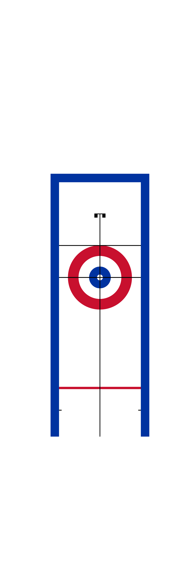
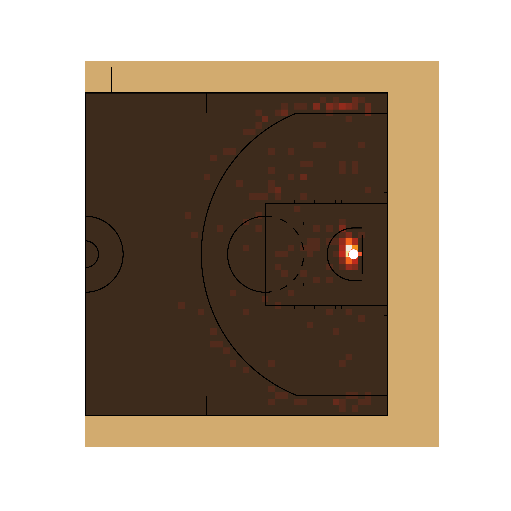

# sportypy

[](https://codecov.io/gh/sportsdataverse/sportypy)
[](https://github.com/sportsdataverse/sportypy/)
[](https://twitter.com/sportypy)
[](https://twitter.com/sportsdataverse)

As the field of sports analytics evolves, there's a growing need for methods to both track and visualize players throughout the game. This package aims to make this easy regardless of sport needed to be plotted.

This repository contains code necessary to draw scale versions of playing surfaces to visualize play-by-play data for baseball, basketball, curling, football, hockey, soccer, and tennis in **Python**. For the **R** version of this package, click [here](https://github.com/sportsdataverse/sportyR).

## Installation

To install `sportypy` via `pip`, please run

```bash
pip install sportypy
```

## Using the Package

Each league that is supported by `sportypy` has its own class in its respective sport under the `surfaces` submodule. As an example, you can instantiate an NHL rink like so:

```python
# Load from the hockey submodule in surfaces
from sportypy.surfaces.hockey import NHLRink

# Create the NHL rink
nhl = NHLRink()
```

If you want to see what this would yield, you may call the `draw()` method that belongs to each league surface, like so:

```python
# Draw the NHL rink
nhl.draw()
```


Each league's class may take on the following arguments:

- `display_range`: This automatically "zooms" in on the area of the plot you're interested in. Valid ranges here vary by sport, but can be found in the docs

- `x_trans` and `y_trans`: By default, the origin of the coordinate system *always* lies at the center of the plot. For example, `(0.0, 0.0)` on a basketball court lies along the division line and on the line that connects the center of each basket. If you want to shift the origin (and therefore the entire plot), use `x_trans` and `y_trans` to do so

- `{surface_type}_updates`: A list of updates to the parameters that define the surface

- `color_updates`: A list that contains updates to the features' colors on the plot. These are named by what the feature is, using `snake_case` to specify the names. To get the list of color names you can change, try running `cani_color_league_features()` from your desired league's class

- `rotation`: An angle (in degrees) that you'd like to rotate the plot by, where +\theta is counterclockwise

- `xlims` and `ylims`: Any limits you'd like to put on the plot in the x and y direction. These will overwrite anything set by the `display_range` parameter

- `{surface}_units`: If your data is in units that are different than how the rule book of the league specifies the units (e.g. you've got NHL data in inches, but the rule book describes the rink in feet), change this parameter to match the units you've got your data in. You're welcome to change the units of the data as well, but this is provided for convenience

## TV View and Display Ranges

### TV View

All of the `draw()` methods, by default, will draw the surface in what can be considered "TV view", or the way that the surface would typically be displayed on a television broadcast. This typically means the action moves from left to right across the screen (a basketball game that has the baskets on the left and right end of the court). As mentioned above, it is possible to change this to be in any orientation through the `rotation` parameter to each `draw()` method.

There are a few exceptions to this:

- `{baseball league}Field` plots are displayed from the high-home view by default, as baseball coordinates typically have the `+y` axis extending from the back tip of home plate towards center field

- `{tennis league}Court` is displayed with the court diagrammed from the perspective of the chair umpire

### Display Ranges

Related to the idea of custom displays of the plot is the concept of the `display_range` parameter in the league's class `draw()` method. This is unique to each sport, but globally supported across the package. This parameter allows the specification of a designated region of the surface to display. As an example, if you're trying to limit the analysis of NFL data to being inside of the red zone, you may want to do something similar to the following:

```python
# Import football fields
from sportypy.surfaces.football import NFLField

# Draw the red zone of an NFL field
NFLField().draw(display_range = "red zone")
```


Another use case would be to make the data you're viewing easier to see. Say you wanted to look at curling data, but only cared about stone positions in the house (and not the path as to how the stones got there). You might do this:

```python
# Import the curling sheets
from sportypy.surfaces.curling import WCFSheet

# Draw only the house of a curling sheet
WCFSheet().draw(display_range = "house")
```



## Surface Units

Each league's surface has a standardized unit of measure in which the plot is created, and is standardized by the primary units specified in their respective rule books. They are as follows (and any explanation is in parentheses):

|    Sport   |              League              | Primary Plotting Unit |
|:----------:|:--------------------------------:|:---------------------:|
|  Baseball  |           Little League          |          `ft`         |
|  Baseball  |               MiLB               |          `ft`         |
|  Baseball  |                MLB               |          `ft`         |
|  Baseball  |               NCAA               |          `ft`         |
|  Baseball  |        NFHS (High School)        |          `ft`         |
|  Baseball  |               Pony               |          `ft`         |
| Basketball |               FIBA               |          `m`          |
| Basketball |                NBA               |          `ft`         |
| Basketball |           NBA G League           |          `ft`         |
| Basketball |               NCAA               |          `ft`         |
| Basketball |               NFHS               |          `ft`         |
| Basketball |               WNBA               |          `ft`         |
|   Curling  |  WCF (World Curling Federation)  |          `ft`         |
|  Football  |                CFL               |          `yd`         |
|  Football  |               NCAA               |          `yd`         |
|  Football  | NFHS11 (High School, 11 players) |          `yd`         |
|  Football  |  NFHS6 (High School, 6 players)  |          `yd`         |
|  Football  |  NFHS8 (High School, 8 players)  |          `yd`         |
|  Football  |  NFHS9 (High School, 9 players)  |          `yd`         |
|  Football  |                NFL               |          `yd`         |
|   Hockey   |                AHL               |          `ft`         |
|   Hockey   |               ECHL               |          `ft`         |
|   Hockey   |               IIHF               |          `m`          |
|   Hockey   |               NCAA               |          `ft`         |
|   Hockey   |                NHL               |          `ft`         |
|   Hockey   |               NWHL               |          `ft`         |
|   Hockey   |                OHL               |          `ft`         |
|   Hockey   |                PHF               |          `ft`         |
|   Hockey   |               QMJHL              |          `ft`         |
|   Hockey   |               USHL               |          `ft`         |
|   Soccer   |                EPL               |          `m`          |
|   Soccer   |               FIFA               |          `m`          |
|   Soccer   |                MLS               |          `yd`         |
|   Soccer   |               NCAA               |          `yd`         |
|   Soccer   |               NWSL               |          `yd`         |
|   Tennis   |                ATP               |          `ft`         |
|   Tennis   |                ITA               |          `ft`         |
|   Tennis   |                ITF               |          `ft`         |
|   Tennis   |               NCAA               |          `ft`         |
|   Tennis   |               USTA               |          `ft`         |
|   Tennis   |                WTA               |          `ft`         |

However, since the data that is supplied may come in various units of measure, the plots are able to be generated in the data's units. This is done via the `{surface_name}_updates` attribute in the class constructor, using the `{surface_name}_units` key. The features themselves will look visually identical, but the underlying coordinate grid will change.

## Examples

Some examples to help navigate the package:

```python
# Draw an NBA court
from sportypy.surfaces.basketball import NBACourt
NBACourt().draw()
```

```python
# Customize a college basketball court to replicate that of the University of
# Illinois Fighting Illini
from sportypy.surfaces.basketball import NCAACourt
NCAACourt(
    colors_dict = {
        "offensive_half_court": "#e8e0d7",
        "defensive_half_court": "#e8e0d7",
        "court_apron": "#e84a27",
        "two_point_range": ["#e8e0d7", "#ffffff66"],
        "center_circle_fill": "#e8e0d7",
        "painted_area": ["#e84a27", None],
        "free_throw_circle_fill": "#e8e0d7",
        "sideline": "#13294b",
        "endline": "#13294b",
        "division_line": "#13294b",
        "center_circle_outline": "#13294b",
        "lane_boundary": ["#ffffff", "#ffffff00"],
        "three_point_line": ["#13294b", "#ffffff"],
        "free_throw_circle_outline": "#ffffff",
        "lane_space_mark": "#ffffff",
        "restricted_arc": "#13294b",
        "backboard": "#13294b"
    }
).draw()
```


## Adding Analyses and Plotting Data

In addition to just creating the baseline plots, `sportypy` has several methods to display analyses on top of the surfaces that the classes create. The syntax is meant to wrap `matplotlib` methods.

Due to the nature of the layering of the surface's features, it's recommended to use the `zorder` parameter in the range of `11` to `15` to display model outputs, and `zorder >= 20` to display individual tracking data points. This allows the features of the surface to be displayed when plotting models while also representing a birds-eye view of any action on the surface (e.g. player positions).

```python
# Plot shot locations provided by the Big Data Cup

# Download the data
bdc = pd.read_csv(
    "https://raw.githubusercontent.com/bigdatacup/Big-Data-Cup-2021/"
    "main/hackathon_nwhl.csv"
)

# Select the Minnesota Whitecaps vs. Boston Pride game (first game in sample)
bdc = bdc.loc[
    (bdc["Home Team"] == "Minnesota Whitecaps") &
    (bdc["Away Team"] == "Boston Pride")
]

# Filter to only be shots
shots = bdc.loc[bdc["Event"].isin(["Shot", "Goal"])]

# Separate shots by team
bos_shots = shots[shots["Team"] == "Boston Pride"]
min_shots = shots[shots["Team"] == "Minnesota Whitecaps"]

# Instantiate a PHF rink, adjusting the coordinates to match the data
# (The coordinate (0, 0) is in the bottom-left of the plot)
phf = hockey.PHFRink(x_trans = 100.0, y_trans = 42.5)

# Draw the rink on a matplotlib.Axes object
fig, ax = plt.subplots(1, 1)
phf.draw(ax = ax)

# Add the plot of each team's shots
phf.scatter(
    bos_shots["X Coordinate"],
    bos_shots["Y Coordinate"],
    color = "#fec52e"
)
phf.scatter(
    200.0 - min_shots["X Coordinate"],
    85.0 - min_shots["Y Coordinate"],
    color = "#2251b8"
)
```


The Whitecaps shots are on the left side. In a future version of this package, logos will be displayed on the plot as well

```python
# Show passing start/end locations with an arrow plot

# This relies on the same Big Data Cup dataset cleaned above

# Filter to only be Boston's passes
passes = bdc.loc[
    (bdc["Team"] == "Boston Pride") &
    (bdc["Event"] == "Play")
]

# Instantiate a PHF rink, adjusting the coordinates to match the data
# (The coordinate (0, 0) is in the bottom-left of the plot)
phf = PHFRink(x_trans = 100.0, y_trans = 42.5)

# Draw the rink on a matplotlib.Axes object
fig, ax = plt.subplots(1, 1)
phf.draw(ax = ax)

# Add the arrow plot of Boston's passes
phf.arrow(
    passes["X Coordinate"],
    passes["Y Coordinate"],
    passes["X Coordinate 2"],
    passes["Y Coordinate 2"],
    color = "#ffcb05"
)
```


```python
# This example adapted from the hockey_rink package's documentation, but can be
# found here: https://github.com/the-bucketless/hockey_rink#examples

# Import packages
import pandas as pd
from sportypy.surfaces.hockey import NHLRink

# Download the data
pbp = pd.read_csv(
    "https://hockey-data.harryshomer.com/pbp/nhl_pbp20192020.csv.gz",
    compression = "gzip"
)

# Find all shots
pbp["goal"] = (pbp["Event"] == "GOAL").astype(int)

# Force all x coordinates to be on the same side of the ice
pbp["x"] = np.abs(pbp["xC"])

# Adjust the y coordinates so the shots are from the same direction
pbp["y"] = pbp["yC"] * np.sign(pbp["xC"])

# Subset to only shots
pbp = pbp.loc[
    (pbp.Ev_Zone == "Off") &
    ~pbp["x"].isna() &
    ~pbp["y"].isna() &
    (pbp.Event.isin(["GOAL", "SHOT", "MISS"]))
]

# Select only relevant columns to reduce data load time
pbp = pbp[["x", "y", "goal"]]

# Create a matplotlib.Axes object for the test plots to lie on
fig, axs = plt.subplots(1, 3, figsize = (14, 8))

# Instantiate an NHL rink
nhl = NHLRink()

# Draw a rink on each of the three matplotlib.Axes objects defined above
# and subset them to only the offensive zone
for i in range(3):
    nhl.draw(ax = axs[i], display_range = "ozone")

# Add the contour plot
contour_img = nhl.contourf(
    pbp["x"],
    pbp["y"],
    values = pbp["goal"],
    ax = axs[0],
    cmap = "bwr",
    plot_range = "ozone",
    binsize = 10,
    levels = 50,
    statistic = "mean"
)

# Add a colorbar legend to the bottom to make the metrics easier to read
plt.colorbar(contour_img, ax = axs[0], orientation = "horizontal")

# Add the heatmap plot
nhl.heatmap(
    pbp["x"],
    pbp["y"],
    values = pbp["goal"],
    ax = axs[1],
    cmap = "magma",
    plot_xlim = (25, 89),  # offensive-side blue line to the goal line
    statistic = "mean",
    vmax = 0.2,
    binsize = 3
)

# Add the hexbin plot
nhl.hexbin(
    pbp["x"],
    pbp["y"],
    values = pbp["goal"],
    ax = axs[2],
    binsize = (8, 12),
    plot_range = "ozone",
    zorder = 25,
    alpha = 0.85
)
```


```python
# Create an NBA shot heat map. The example below uses Ayo Dosunmu's rookie
# season

# Import packages
import json
import numpy as np
import pandas as pd
from sportypy.surfaces.basketball import NBACourt
from nba_api.stats.endpoints import shotchartdetail

# Make API request
response = shotchartdetail.ShotChartDetail(
    team_id = 0,
    player_id = 1630245,
    season_nullable = "2021-22",
    season_type_all_star = "Regular Season",
    context_measure_simple = "FGA"
)

# Extract the json content
content = json.loads(response.get_json())

# Form the data set
results = content["resultSets"][0]
headers = results["headers"]
rows = results["rowSet"]
shot_data = pd.DataFrame(rows)
shot_data.columns = headers

# Rotate the coordinates to align with sportypy convention
theta = 0.5 * np.pi
shot_data["x_r"] = (
    (shot_data["LOC_X"] * math.cos(theta)) -
    (shot_data["LOC_Y"] * math.sin(theta))
)

shot_data["y_r"] = (
    (shot_data["LOC_X"] * math.sin(theta)) +
    (shot_data["LOC_Y"] * math.cos(theta))
)

# Divide by 10 since NBA API gives coordinates in 1/10 of feet measurements
shot_data["LOC_X"] = shot_data["x_r"] / 10.0
shot_data["LOC_Y"] = shot_data["y_r"] / 10.0

# Drop extra columns
shot_data.drop(labels = ["x_r", "y_r"], axis = 1)

# Create SHOT_RESULT used for heatmapping
shot_data["SHOT_RESULT"] = np.where(
    shot_data["EVENT_TYPE"] == "Made Shot", 1, 0
)

# Define the matplotlib instances to plot onto
fig, ax = plt.subplots(1, 1)

# Start by instantiating a court class. NBA shot data is what's used, so
# an NBA court is selected. The rotation is to display a traditional shot
# chart of only the offensive half
nba = NBACourt(x_trans = -41.75)
ax = nba.draw(display_range = "offense")
nba.heatmap(
    shot_data["LOC_X"],
    shot_data["LOC_Y"],
    values = shot_data["SHOT_RESULT"],
    ax = ax,
    alpha = 0.75,
    cmap = "hot"
)
```



## License

This package is released under the [GPL 3.0 License](https://github.com/sportsdataverse/sportypy/blob/master/LICENSE).

## Contributions

### League Office

The package maintainers and functional engineers

- [Ross Drucker](https://github.com/rossdrucker) - `sportypy` Commissioner

### General Managers

Contribute by adding a new sport and become its general manager. Current general managers (and their sports) are:

- [Ross Drucker](https://github.com/rossdrucker) - Baseball
- [Ross Drucker](https://github.com/rossdrucker) - Basketball
- [Ross Drucker](https://github.com/rossdrucker) - Curling
- [Ross Drucker](https://github.com/rossdrucker) - Football
- [Ross Drucker](https://github.com/rossdrucker) - Hockey
- [Ross Drucker](https://github.com/rossdrucker) - Soccer
- [Ross Drucker](https://github.com/rossdrucker) - Tennis

### Coaching Staffs

Notice something for a sport that already exists, but isn't quite right? Join that sport's coaching staff!

### Scout Team

By regularly reporting issues, making very slight modifications, fixing typos, or just helping others navigate their own issues, you're able to join the Scout Team!

### Acknowledgements

Much of the underling code structure in `sportypy` was directly influenced and inspired by [The Bucketless](https://github.com/the-bucketless)'s work on the [hockey_rink](https://github.com/the-bucketless/hockey_rink) package. This package is meant to extend the capability that `hockey_rink` provides hockey analysts to analysts of a wider variety of sports

### `sportypy` Logo Artist

The `sportypy` logo was created by Lindsey Kelso. Check her out on [Instagram](http://Instagram.com/kelsokreationsbylindsey) or her [online shop](http://kelsokreationsbylindsey.bigcartel.com)!
